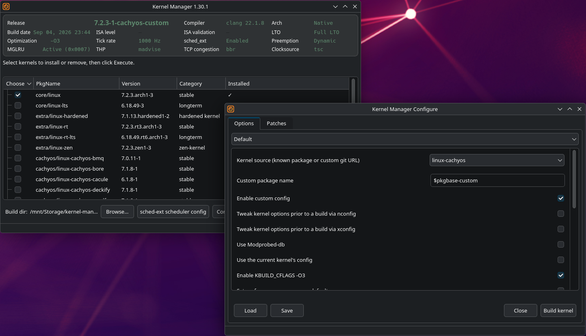

# kernel-manager

Build and install custom Linux kernels on Arch — from a clean Qt6 desktop app.

[](https://github.com/MadGoatHaz/kernel-manager/actions/workflows/build.yml)
[](https://github.com/MadGoatHaz/kernel-manager/actions/workflows/checks.yml)
[](https://aur.archlinux.org/packages/kernel-manager)
[](https://aur.archlinux.org/packages/kernel-manager-bin)
[](LICENSE)

Pick a kernel, choose your build options, hit install. kernel-manager builds it (`makepkg`) and installs it (`pacman -U`); your distro's own hooks handle the rest — DKMS drivers, initramfs, bootloader entry. 21 kernel variants supported across official Arch, CachyOS, and community repos.

📖 **[Full User Guide](docs/USER_GUIDE.md)** — detailed feature reference, usage, and troubleshooting.

## Screenshots



## Features

- **Multi-kernel management** — install, remove, and configure Arch, CachyOS, and community kernels (21 maintained variants, each mapped to its own build source) from a single interface.
- **Active kernel telemetry** — a compact hero header showing your booted kernel's release, compiler, architecture, and 12 runtime metrics in a unified 4-column grid.
- **Refresh & purge** — re-scan the kernel list on demand and clear stale built or folder-based entries with one click.
- **Custom kernel builds** — per-kernel build options (the full 17-option CachyOS suite, CPU-optimization + modprobed-db for XanMod, and more), compiled with `makepkg`; post-install work (NVIDIA DKMS, initramfs, bootloader entry) is left to the distro's own alpm hooks.
- **sched_ext support** — optional integration with `scx-manager` to enable and configure sched-ext (BPF) schedulers on supported kernels.
- **Dynamic pacman-lock awareness** — a warning banner appears automatically while a pacman instance holds the database lock, and disappears within 2 s of the lock releasing.
- **Driver gate** — detects GPU driver packaging before kernel operations and warns about conflicts (offering a one-click migration from precompiled to DKMS nvidia drivers).
- **Distribution-aware** — detects the distro family from `/etc/os-release` (Arch, EndeavourOS, Manjaro, CachyOS, Garuda, and other Arch-based systems) and adapts the initramfs tool and BLS path accordingly.
- **Multi-architecture** — supports x86_64, i686, aarch64, loongarch64, and riscv64 kernel builds.
- **Clear install feedback** — every install reports a two-state result: **Installed** (green) or **Failed** (red, with the real exit code). The terminal output is the source of truth — no silent skips. The running version is shown in the window title and the status bar.

## Supported kernels

kernel-manager tracks 21 maintained Arch kernel variants, each mapped to its own build source.

### Official Arch kernels

| Kernel | Description |
|--------|-------------|
| `linux` | Upstream stable — the default reference kernel |
| `linux-lts` | Long-term support (LTS) branch for stability-critical systems |
| `linux-zen` | Low-latency tuning for desktops and gaming (Zen patchset) |
| `linux-hardened` | Security-hardened with exploit mitigations |
| `linux-rt` | PREEMPT_RT real-time |
| `linux-rt-lts` | PREEMPT_RT on an LTS base |

### CachyOS kernels

| Kernel | Description |
|--------|-------------|
| `linux-cachyos` | Optimized mainline — Clang ThinLTO, AutoFDO/Propeller, BORE scheduler |
| `linux-cachyos-bore` | Tuned for interactive latency and frame pacing (BORE scheduler) |
| `linux-cachyos-rt-bore` | PREEMPT_RT determinism combined with BORE |
| `linux-cachyos-lts` | LTS base with the CachyOS patchset |
| `linux-cachyos-server` | Server-oriented: lazy preemption, high-throughput configuration |
| `linux-cachyos-deckify` | Handheld gaming (Steam Deck, MSI Claw, and similar) |
| `linux-cachyos-bmq` | BMQ bitmap-queue scheduler |

### Community kernels

| Kernel | Description |
|--------|-------------|
| `linux-mainline` | Tracks Linus' master branch and release candidates |
| `linux-tkg` | Configurable build framework — choose scheduler, LTO mode, and patches |
| `linux-xanmod` | XanMod performance suite for low-latency desktops |
| `linux-xanmod-edge` | XanMod on bleeding-edge mainline |
| `linux-xanmod-lts` | XanMod on an LTS base |
| `linux-xanmod-rt` | XanMod with PREEMPT_RT |
| `linux-lqx` | Liquorix — low-latency audio and multimedia |
| `linux-clear` | Intel Clear Linux performance patchset |

## How it works

kernel-manager opens on the **Active Kernel Information** header — the release, compiler, architecture, and 12 runtime metrics of the kernel currently booted, at a glance. Below it, pick a kernel and its build options: kernel-manager either installs the pre-compiled package or clones the AUR source, builds it with `makepkg`, and installs it with a single `pacman` command. The distro's own post-transaction hooks (NVIDIA DKMS, `kernel-install`/dracut) then rebuild drivers, regenerate the initramfs, and create the bootloader entry. Use **Refresh** at any time to re-scan the kernel list and purge stale built or folder-based entries. kernel-manager reports success or failure with the real exit code — no silent skips and no ambiguous "probably fine" states — and a bootloader-aware dialog walks you through selecting the new kernel at your next start.

## Requirements

- A recent Arch Linux or Arch-based distribution (EndeavourOS, CachyOS, Manjaro, Garuda, and others — see the distribution-aware behavior above)
- C++23 compiler (tested with GCC 14+ and Clang 18)
- Qt6 (Widgets, Concurrent, LinguistTools)
- `libalpm` (pacman) ≥ 13.0.0 and `glib` ≥ 2.72.1
- `polkit-qt6` (build-time CMake configuration)
- Rust — for the Corrosion/cxx config bridge
- CMake ≥ 3.20 and Python 3 (for compile-option code generation)

Install the build dependencies on Arch Linux:

```sh
sudo pacman -S \
    base-devel cmake pkg-config make qt6-base qt6-tools polkit-qt6 python rust
```

(`rust` is required for the Corrosion/cxx config bridge; `git` ships with `base-devel`.)

## Installing

### From the AUR

`kernel-manager` is published on the [Arch User Repository](https://aur.archlinux.org/packages/kernel-manager):

```sh
# with any AUR helper (yay, paru, trizen, ...)
yay -S kernel-manager
# or
paru -S kernel-manager
```

A rolling `kernel-manager-git` variant (tracking the `main` branch) is not currently on the AUR and may be offered in a future release.

### Packages

Two AUR entries install the same application — they conflict with each other, so only one can be present. Pick the one that matches how you want it built:

| Entry | Build model | Install |
|-------|-------------|---------|
| [`kernel-manager-bin`](https://aur.archlinux.org/packages/kernel-manager-bin) | Precompiled x86_64 binary — zero build dependencies (no cmake, no cargo, no CPM fetches) | `yay -S kernel-manager-bin` |
| [`kernel-manager`](https://aur.archlinux.org/packages/kernel-manager) | Source build in your AUR chroot (full build toolchain) | `yay -S kernel-manager` |

- **Desktop users** → `kernel-manager-bin`: one command, nothing compiled.
- **scx-manager (sched-ext) support or a custom/patched build** → `kernel-manager` (source): the prebuilt binary ships with scx-manager compiled out, so sched-ext management requires the source package (see [Optional: sched-ext support](#optional-sched-ext-scx-manager-support) below).
- **Switching** is one command in either direction: `pacman -S kernel-manager` (or `pacman -S kernel-manager-bin`) removes the other and installs the chosen package in a single transaction — no state migration needed.

### From source

This is tested on Arch Linux, but *any* recent Arch-based system with a current C++23 compiler should work:

```sh
git clone https://github.com/MadGoatHaz/kernel-manager.git
cd kernel-manager
```

The project is built with **CMake only** (there is no other build system). Configure and build:

```sh
cmake -S . -B build -DCMAKE_BUILD_TYPE=Release
cmake --build build -j$(nproc)
```

Run the built binary:

```sh
./build/kernel-manager
```

Optionally install it for your user (no `sudo` required):

```sh
cmake --install build --prefix ~/.local
```

`configure.sh` is an alternative entry point: it wraps the CMake invocation and generates `build.sh`, which drives `cmake --build` (if you intend to install it globally, you might also want `--prefix=/usr`):

```sh
./configure.sh --prefix=/usr/local
./build.sh
```

### Optional: sched-ext (scx-manager) support

Managing sched-ext (BPF) schedulers via scx-manager is **optional**. CMake probes for `scxctl-ui` at configure time:

- **default (no flag):** auto — enabled if `scx-manager` is installed, disabled otherwise (re-evaluated on every configure)
- `-DWITH_SCX_MANAGER=ON`: force the feature on (requires `scx-manager` to be installed; a missing package is a hard error)
- `-DWITH_SCX_MANAGER=OFF`: force the feature off

```sh
cmake -S . -B build -DWITH_SCX_MANAGER=OFF   # generic-Arch build, no scx
cmake --build build -j$(nproc)
```

`scx-manager` ships in the CachyOS repository and is available via the AUR on generic Arch; it is declared as an optional dependency (`optdepends`) in the package builds.

## Known Issues

### clang 22.1.8 thin-LTO kernel build crash

As of **2026-09-07**, building a kernel with **clang 22.1.8** and **thin LTO** (`-flto=thin -fsplit-lto-unit`) can crash clang mid-build:

```
free(): invalid next size (normal)
clang: error: clang frontend command failed with exit code 139
```

**This is a confirmed bug in clang 22.1.8** (heap corruption in the constant-expression evaluator during CFG construction for analysis-based warnings, triggered by complex macro expansions such as XFS tracepoints evaluated under LTO), **not a defect in kernel-manager** — your build configuration and kernel source are fine.

**Workarounds:**

- Use a stable clang release (19 or 20) — select it in kernel-manager's Compiler config, or build with `make CC=clang-19`
- Use GCC, which handles thin LTO without this issue — `make CC=gcc`
- File a bug with LLVM: <https://github.com/llvm/llvm-project/issues> — attach the preprocessed source and the run script clang writes to `/tmp/` before crashing

The issue is tracked against the clang 22.1.8 release and is expected to be resolved in a subsequent point release.

## Development

**Build from source** (see [Installing](#from-source)):

```sh
cmake -S . -B build -DCMAKE_BUILD_TYPE=Release
cmake --build build -j$(nproc)
./build/kernel-manager
```

**Run the tests** — the project ships a standalone unit-test suite of 17 harnesses under `tests/` (one `run_*.sh` driver each), which compile the relevant sources with the project's full warning set and assert against the real APIs. The full suite is expected to pass with zero compiler warnings:

```sh
for t in tests/run_*.sh; do bash "$t"; done
```

An offscreen smoke launch (`QT_QPA_PLATFORM=offscreen ./build/kernel-manager`) should stay alive with no output.

**Project structure:**

- `src/` — the C++23 / Qt6 application (main window, configure dialog, install engine, bootloader + distro detection, terminal helpers)
- `config-option-lib/` — the Rust config-option bridge (built into the C++ app via Corrosion / cxx)
- `tests/` — the standalone test harnesses and their `run_*.sh` drivers
- `cmake/` — CMake modules and configuration
- `icons/`, `lang/` — the application icon assets and translation catalogs

**Libraries:** Qt (GUI), fmt (string formatting / logging, via CPM), frozen (compile-time option maps), and Corrosion / cxx (the Rust config bridge).

## Contributing

Contributions are welcome! Report bugs and suggest features via the [issue tracker](https://github.com/MadGoatHaz/kernel-manager/issues), or open a pull request against the `main` branch. The project ships a standalone unit-test suite under `tests/` (run via the accompanying `run_*.sh` scripts) — please keep the CMake build free of new compiler warnings and extend the tests to cover any new functionality. See [Changelog.md](Changelog.md) for the project's release history.

## License

kernel-manager is licensed under the [GNU General Public License v3.0 or later](LICENSE).
